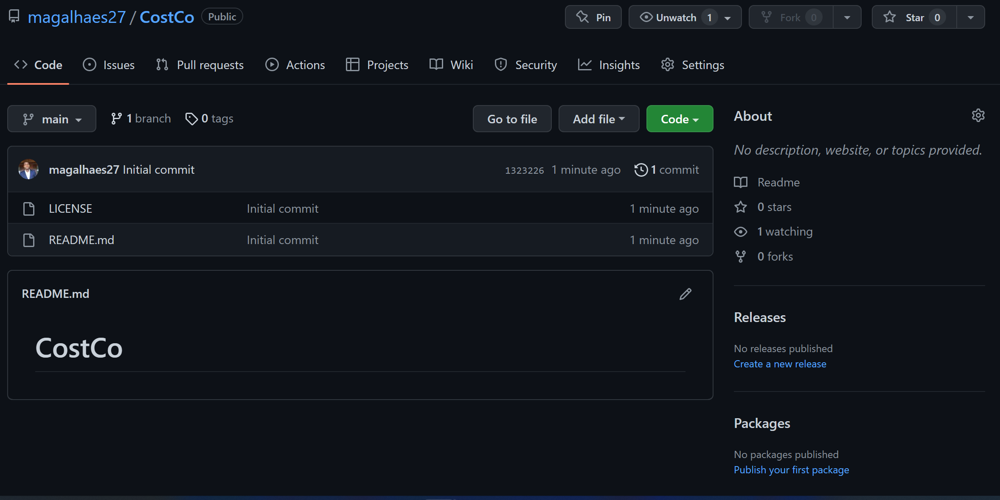
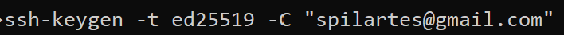
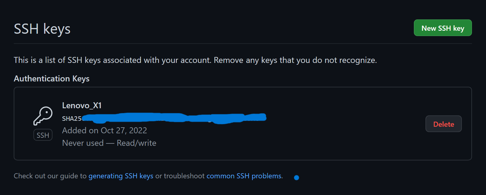
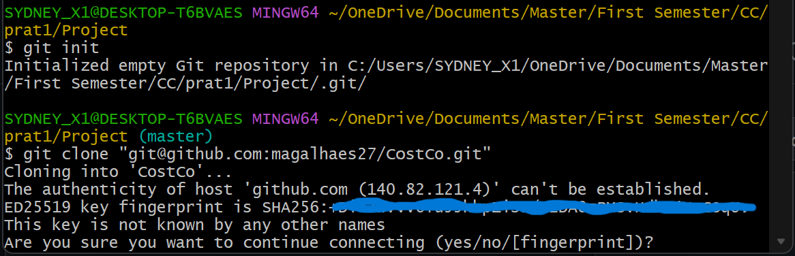

Creación del Repositorio

Para la creación del repositório, se ha realizado las siguientes tareas:

Ha sido creado un repositorio en el GitHub en mi cuenta con nombre CostCo. 

En seguida se creó las claves publica y privada para aceder el repositorio una vez clonado el mismo al dispositivo donde se va a desarrollar la aplicación.

Esta linea define el comando para generar llaves publica y privada en el dispositivo, que se almacena en la carpeta .ssh, posterior a eso tenemos que copiar la llave publica (la que tiene la extensión .pub) y colar como clave SSH en configuración de GitHub.

Después de este proceso ya podemos clonar nuestro repositório a la computadora como se muetra en la siguiente image.

