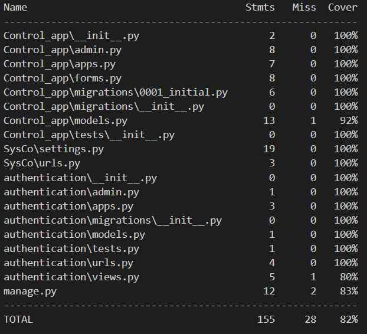
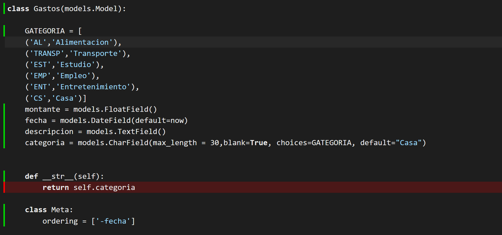
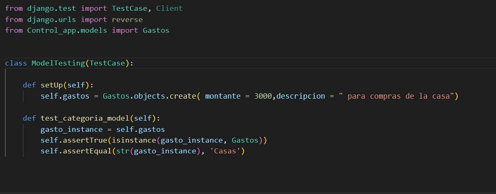
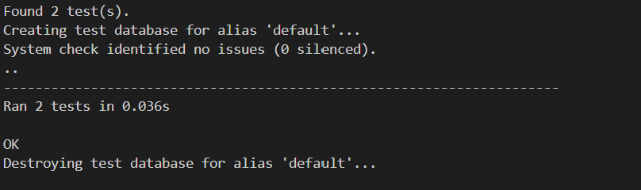
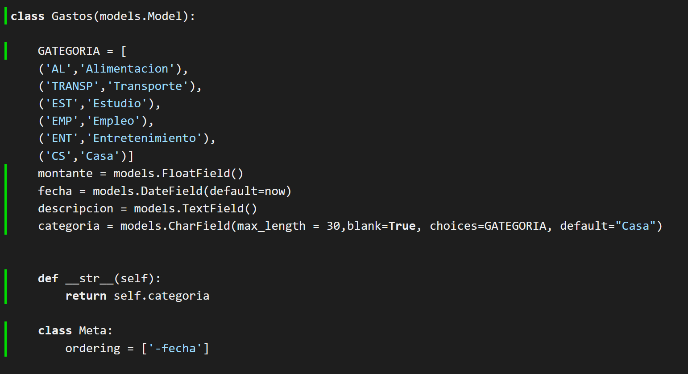

# Entorno de testeo
En esta etapa he hecho posibles analisis del framework usado para testeo.
Al principio el desarrollo de la aplicación es en Django y lo bueno es que Django posee módulos especificos para el testeo y uno de los mas comunes es [Unittest] (https://docs.djangoproject.com/en/4.1/topics/testing/overview/),la cual se define los tests basados en clases.

He seleccionado este por estar incorporado en el framework y ser el mas usado por la comunidad, siendo que en cualquier situación se entrave hay donde buscar posibles ideas para solucionar cualquier problema. De igual modo puede ser usado para la realización de testeo unitario y también automático.
Su estructura en el framework ayuda en la facilidad de la compreensión del código.

Para el desarrollo de la aplicación he creado una carpeta "testes" donde he adicionado los ficheros para los distintos tests, a continuación se muestra la realización de los tests realizados para las vistas y el modelo de la clase Gastos.

He usado la herramienta [Coverage](https://coverage.readthedocs.io/en/7.1.0/) para el monitoreo de código en programas desarrollados en python. he ejecutado el comando **coverage report** para saber cuales son las partes del código que se necesita hacer los tests.

En esta parte nos interesa resolver el test en el fichero *models.py* donde se encuentra las clases definidas para nuestra base de datos.

**Definición del test**

En esta imagen muestra que es necesario testear la clase *Gastos*, como resultado. Despues de testear se tiene como resultado:

Podemos ver que yano tenemos la linea en rojo en la clase Gastos
