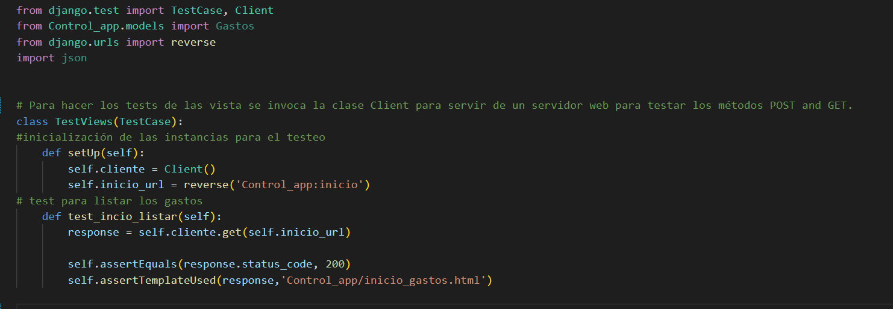
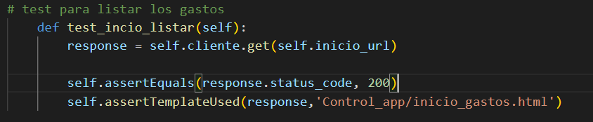
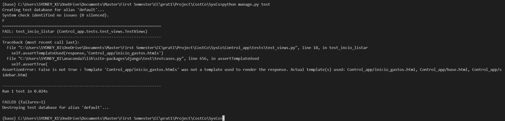

# Entorno de testeo
En esta etapa he hecho posibles analisis del framework usado para testeo.
Al principio el desarrollo de la aplicación es en Django y lo bueno es que Django posee módulos especificos para el testeo y uno de los mas comunes es [Unittest] (https://docs.djangoproject.com/en/4.1/topics/testing/overview/),la cual se define los tests basados en clases.

He seleccionado este por estar incorporado en el framework y ser el mas usado por la comunidad, siendo que en cualquier situación se entrave hay donde buscar posibles ideas para solucionar cualquier problema. De igual modo puede ser usado para la realización de testeo unitario y también automático.
Su estructura en el framework ayuda en la facilidad de la compreensión del código.

Para el desarrollo de la aplicación he creado una carpeta "testes" donde he adicionado los ficheros para los distintos tests, a continuación se muestra la realización de un testeo realizado para las vistas del módulo Gastos.

en seguida ejecutamos los tests

el resultados el positivo cuando todo esté bien, ahora supongamos que la dirección de la url sea una desconocida

![](img/test_vista_merror.png

Este es el resultado

