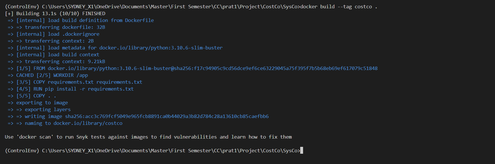
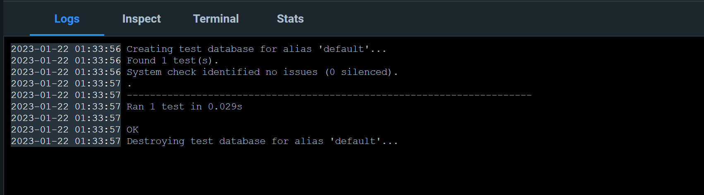
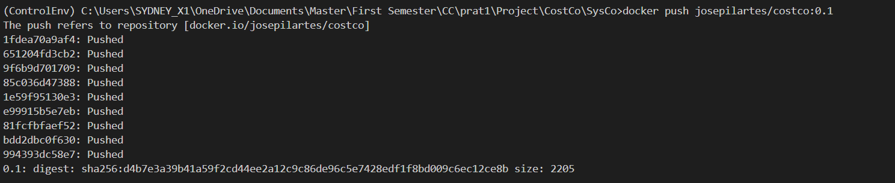
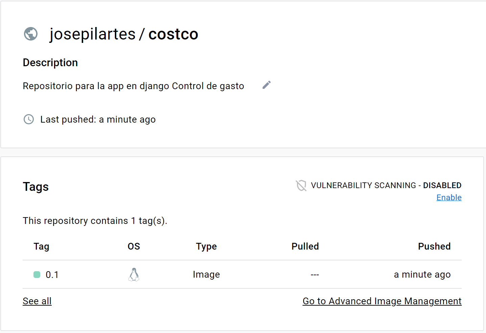

# Configuración del Docker

Para este paso primer se ha definido que sistema operativo podria crear una imagen con menos capacidad he analizado el [Linux mint](https://linuxmint.com/) y [Linux Alpine](https://hub.docker.com/_/alpine) como se puede observar el SO Alpine tiene menos capacidad.

Al final ha resultado en el siguiente 

Montando el image

Con la image ya montada en docker, vamos a ejecutarla y ver los tests

Vemos que los testes se ejecutan igual como en la máquina.

Ahora vamos a subirla en DockerHub con el comando "docker push josepilartes/costco:0.1"

y podemos observar en el dockerhub que tenemos el contenedor de esta imagen

