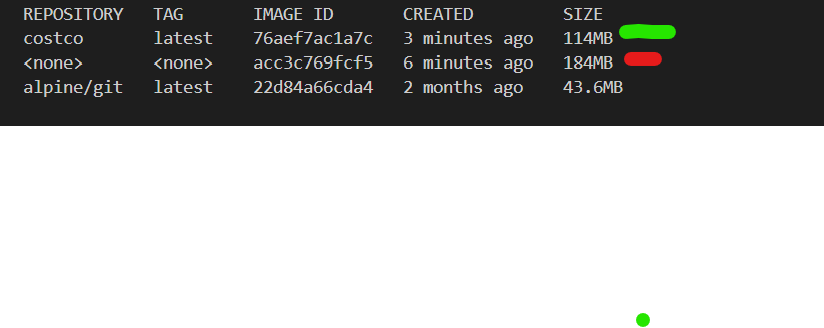
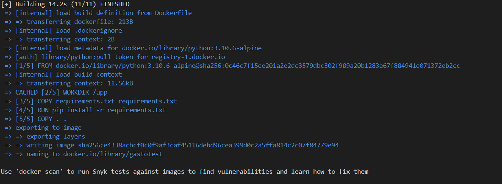
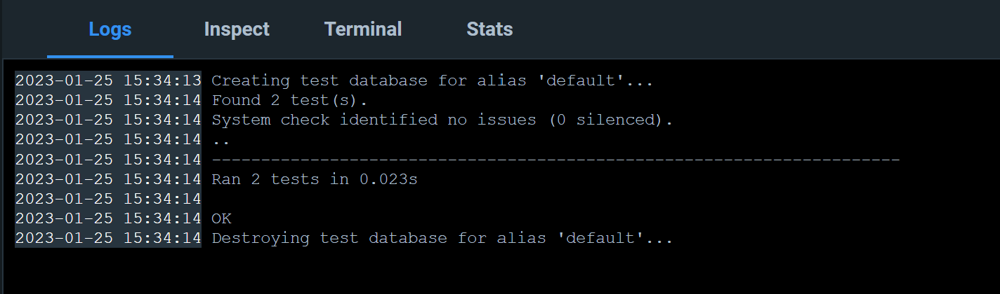
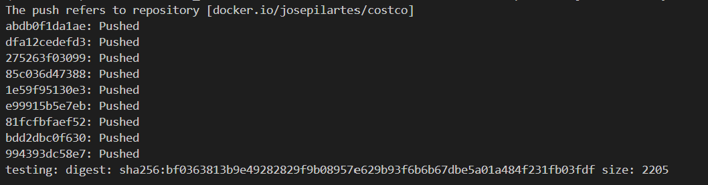
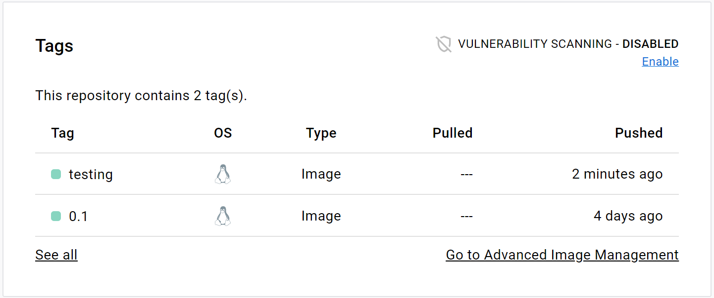

# Configuración del Docker

Para este paso primer se ha definido que sistema operativo podria crear una imagen con menos capacidad he analizado el [Linux mint](https://linuxmint.com/) y [Linux Alpine](https://hub.docker.com/_/alpine) como se puede observar el SO Alpine tiene menos capacidad.

Al final ha resultado en el siguiente ![DOCKERFILE][./Dockerfile]

Montando el imagen

Con la image ya montada en docker, vamos a ejecutarla y ver los tests

Vemos que los testes se ejecutan igual como en la máquina.

Ahora vamos a etiquetar nuestra imagen en el repo del DockerHub creado con el comando *docker tag gastotest josepilartes/costco:testing* y en seguida subirla en DockerHub con *docker push josepilartes/costco:testing*

y podemos observar en el dockerhub que tenemos el contenedor de esta imagen denominada **testing**

