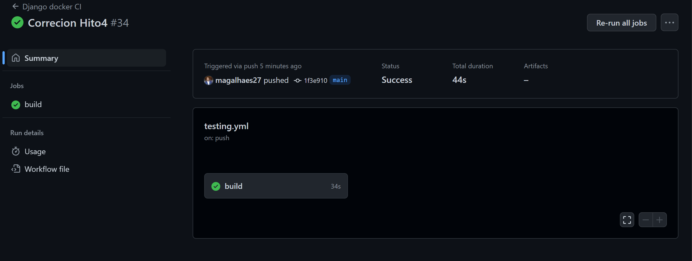
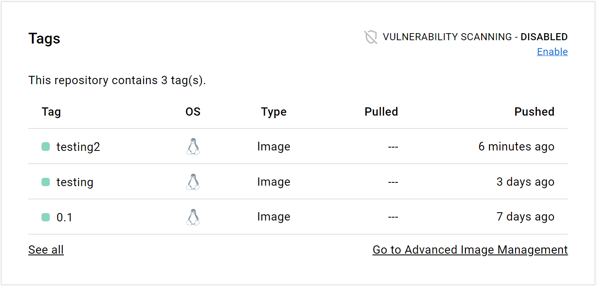

# Integración continua
Para este proceso he decidido usar [gitHub action](https://docs.github.com/en/actions), por su facilidad al usar.
Se ha creado dos ficheros yaml, la [integración con docker](/.github/workflows/run-docker-image.yml) y el del [testing](/.github/workflows/testing.yml)

Como se puede observar la imagen fue creada y  por la definición de los secrets se ha subido al dockerHub.

